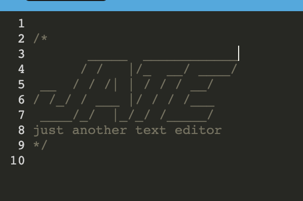

# pwapatrol

| Technology Used         | Resource URL           | 
| ------------- |:-------------:| 
| Git | [https://git-scm.com/](https://git-scm.com/)     |    
| JavaScript | [https://developer.mozilla.org/en-US/docs/Web/JavaScript](https://developer.mozilla.org/en-US/docs/Web/JavaScript)     
| Node.JS| [https://developer.mozilla.org/en-US/docs/Glossary/Node.js?utm_source=wordpress%20blog&utm_medium=content%20link&utm_campaign=promote%20mdn](https://developer.mozilla.org/en-US/docs/Web/API/Fetch_API)    


## Description 



Video of the application in action: 

This is a social media backend which has a collection of users, their thoughts and reactions to those thoughts.  


## Code Refactor Example


Below is some code

```Javascript
module.exports = () => {
  return {
    mode: 'development',
    entry: {
      main: './src/js/index.js',
      install: './src/js/install.js'
    },
    output: {
      filename: '[name].bundle.js',
      path: path.resolve(__dirname, 'dist'),
    },
    plugins: [
      new HtmlWebpackPlugin({
        template: "./index.html",
        title: "JATE"
      }), 
      new InjectManifest({
        swSrc: "./src-sw.js",
        swDest: "src-sw.js"
      }),

      new GenerateSW(),
      new WebpackPwaManifest({
        fingerprints: false,
        inject: true, 
        name: "Just Another Text Editor",
        short_name: "Just Another Text Editor",
        description: "take notes with JS syntax highlighting",
        background_color: "#225ca3",
        theme_color: "#225ca3",
        start_url: "/",
        publicPath: "/",
        icons: [
          {
            src: path.resolve("src/images/logo.png"),
            sizes: [96,128,192,256,384,512],
            destination: path.join("assets", "icons"),

          },
        ],
      }),
      
    ],


```

Below is a code

``` JavaScript
new GenerateSW(),
      new WebpackPwaManifest({
        fingerprints: false,
        inject: true, 
        name: "Just Another Text Editor",
        short_name: "Just Another Text Editor",
        description: "take notes with JS syntax highlighting",
        background_color: "#225ca3",
        theme_color: "#225ca3",
        start_url: "/",
        publicPath: "/",
        icons: [
          {
            src: path.resolve("src/images/logo.png"),
            sizes: [96,128,192,256,384,512],
            destination: path.join("assets", "icons"),

          },
        ],
      }),
      
    ],

    module: {
      rules: [
        {
          test: /\.css$/i,
          use: ["style-loader","css-loader"], 

        },
      {
        test: /\.m?js$/i,
        exclude: /node_modules/,
        use: {
          loader: "babel-loader",
          options: {
            presets: ["@babel/preset-env"],
            plugins: ["@babel/plugin-proposal-object-rest-spread", "@babel/transform-runtime"],
          },
        },

      } , 
      ],
    },
  };
};

``` 


## Usage 

You will need to clone down all the repro.  Install the needed NPM packages. Then you will be able to execute the program by running npm start


## Learning Points 


Just getting started on React stuff.   

## Author Info

SWEngineer looking to learn as much as I can, hope to one day solo create an amazing videogame. 

* [Portfolio](https://bdalberson.github.io/Course2Biopage/)
* [LinkedIn](https://www.linkedin.com/in/brian-alberson-464b2271/)
* [Github](https://github.com/bdalberson)
```

## Credits

TAs like Kyle helped a lot, study groups, and of course my family giving me time and space and work on this code money stuff. 

---

## Tests
Nada
